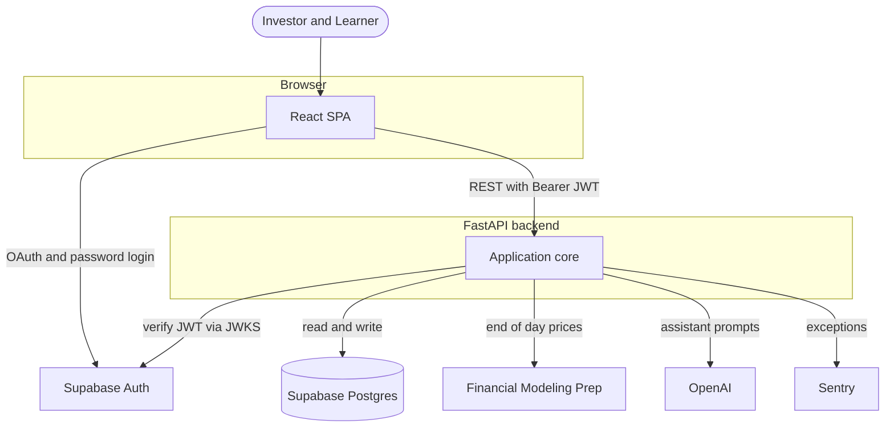
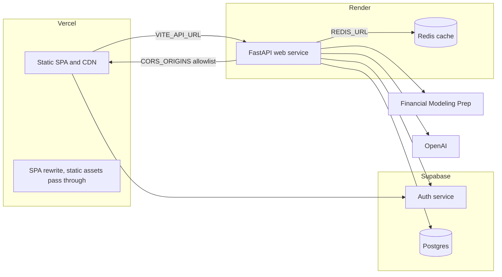
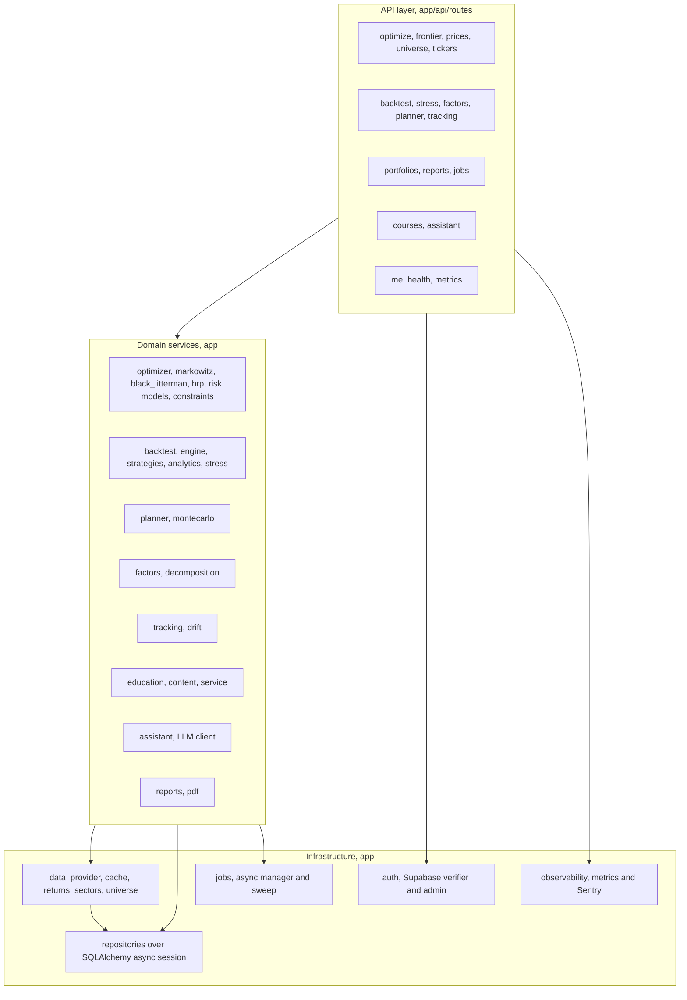
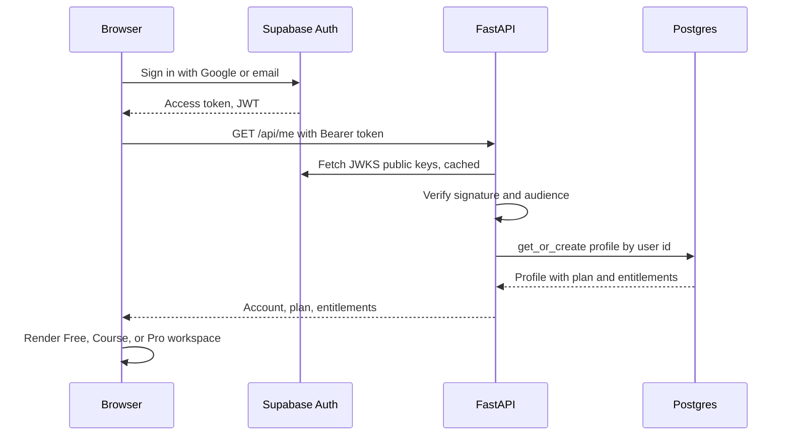
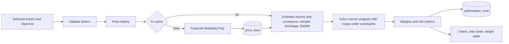
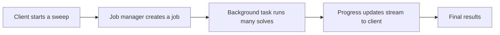
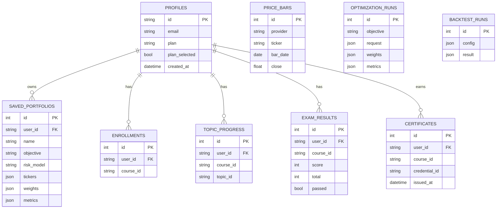
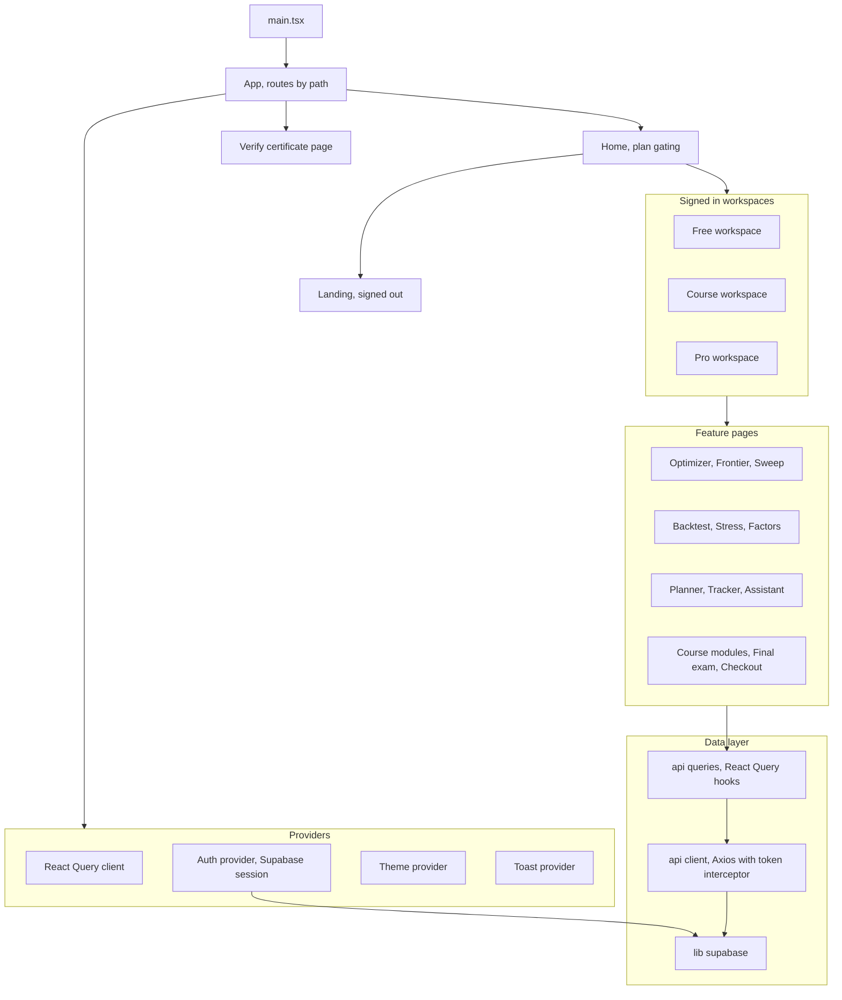

# Halo System Architecture

Halo is a full stack web application for building mathematically optimal
stock portfolios with convex optimization, learning the theory behind them, and
backtesting every strategy against a plain index fund on real market data.

This document reflects the current shipped system. Every diagram is written in
Mermaid so it renders directly on GitHub and in most editors.

## Contents

1. Technology stack
2. System context
3. Deployment topology
4. Backend architecture
5. Authentication and request lifecycle
6. Core optimization data flow
7. Asynchronous jobs
8. Data model
9. Frontend architecture
10. API surface
11. Repository layout
12. Cross cutting concerns

---

## 1. Technology stack

| Layer | Technology | Role |
| --- | --- | --- |
| Frontend | React 18, TypeScript, Vite | Single page application |
| Frontend data | TanStack Query, Axios | Server state and HTTP client |
| Charts | Recharts | Allocation, frontier, backtest, planner charts |
| Auth client | supabase-js | Google OAuth and email sign in |
| Backend | FastAPI, Uvicorn | REST API and ASGI server |
| Optimization | cvxpy, NumPy, pandas | Convex solvers and numerical work |
| Persistence | SQLAlchemy 2 async, asyncpg | ORM and Postgres driver |
| Cache | Redis | Market data and computation cache |
| Auth verification | PyJWT with JWKS | Validates Supabase access tokens |
| Reports | ReportLab | PDF export |
| Market data | Financial Modeling Prep | Real end of day prices |
| AI assistant | OpenAI | Natural language answers |
| Monitoring | Sentry | Error and performance tracking |
| Hosting | Vercel, Render, Supabase | Frontend, backend, auth and database |

---

## 2. System context

How the browser, the API, and the external services fit together.



---

## 3. Deployment topology

Three managed platforms host the system, all on free tiers. The environment
variables that wire the pieces together are called out on the edges.



Notes.

- The frontend builds with Vite and deploys as static files behind Vercel's CDN. A rewrite rule sends only extensionless routes to `index.html` so real assets such as screenshots are served directly.
- The backend runs as a single Render web service started with Uvicorn. On the free tier it sleeps after inactivity, so the first request after idle takes longer while it wakes.
- Redis runs as a managed Render service and its connection string is injected into the web service as `REDIS_URL`. Locally, where that variable is absent, the cache falls back to an in memory implementation.
- Postgres and Auth are Supabase managed. The API never holds user passwords, it only verifies signed tokens.

---

## 4. Backend architecture

The API is organised into three tiers. A thin routing layer, a set of domain
services, and shared infrastructure. Application wide singletons are created once
during the FastAPI lifespan and attached to application state.



Dependency injection wires these together. Each request pulls the services it
needs from application state through FastAPI dependencies in `app/api/deps.py`,
which keeps routes small and testable.

---

## 5. Authentication and request lifecycle

Login happens entirely between the browser and Supabase. The backend never sees a
password, it only trusts a signed JWT and validates it against Supabase public
keys.



Cross origin requests from the Vercel site are permitted by the CORS middleware,
which reads its allowlist from `CORS_ORIGINS`. Account deletion is the one
privileged action, so it runs server side with the Supabase service role key and
also clears every row the app stores for that user.

---

## 6. Core optimization data flow

The path from a list of tickers to an optimal set of weights.



Supported objectives include minimum variance, maximum Sharpe, target return, and
target risk. The same estimation and solver stack powers the efficient frontier,
the resampled frontier, backtesting, and the goal planner.

---

## 7. Asynchronous jobs

Long running work such as a parameter sweep or a resampled frontier does not block
a request. An in process job manager runs the work in the background and streams
progress to the client, which drives the sweep view in the frontend.



---

## 8. Data model

All persistent state lives in Supabase Postgres and is defined by the SQLAlchemy
models in `app/db/models.py`. The `profiles` table is the hub for everything a
signed in user owns. Its id equals the Supabase user id. Price bars, optimization
runs, and backtest runs are global rather than user scoped.



A certificate carries a unique `credential_id` that backs a public verification
page, so a completed track can be shared and checked by anyone.

---

## 9. Frontend architecture

The SPA renders one of three experiences based on the signed in user's plan. A
small set of providers wrap the tree, and a single Axios client attaches the
Supabase access token to every API call.



---

## 10. API surface

Every route is mounted under the `/api` prefix. Endpoints are grouped here by
domain rather than listed exhaustively.

| Domain | Representative endpoints | Purpose |
| --- | --- | --- |
| Health | GET /api/health | Service status and active data provider |
| Universe and tickers | GET /api/universe, GET /api/tickers | Curated universe and ticker validation |
| Prices | GET /api/prices | End of day price history |
| Optimize | POST /api/optimize, GET /api/optimize history | Solve and list optimization runs |
| Frontier | GET /api/frontier, resampled frontier | Efficient and resampled frontiers |
| Backtest | POST /api/backtest | Walk forward backtest versus benchmarks |
| Stress | POST /api/stress | Historical and scenario stress tests |
| Factors | POST /api/factors | Style factor decomposition |
| Planner | POST /api/planner | Monte Carlo goal projections |
| Tracking | POST /api/tracking | Weight drift and rebalance alerts |
| Portfolios | GET, POST, DELETE /api/portfolios | Saved portfolios |
| Reports | POST /api/reports | PDF export |
| Jobs | job start and progress | Async sweeps |
| Courses | GET /api/courses and progress | Learning tracks, modules, exams, certificates |
| Assistant | POST /api/assistant | AI answers about a portfolio |
| Account | GET /api/me, PUT /api/me/plan, DELETE /api/me | Profile, plan, and account deletion |
| Metrics | GET /api/metrics | Request metrics |

---

## 11. Repository layout

```text
optimal-portfolio
├── frontend/                     React and TypeScript SPA (Vercel)
│   ├── src/
│   │   ├── api/                  Axios client, React Query hooks, types
│   │   ├── auth/                 Supabase session provider and hooks
│   │   ├── components/           Charts, tables, modals, workspace UI
│   │   ├── pages/                Landing, workspaces, feature pages
│   │   ├── lib/                  supabase client, formatting, course logic
│   │   ├── theme/ toast/         Theme and toast providers
│   │   └── index.css             Design system and styles
│   ├── public/screenshots/       Product screenshots used on the landing page
│   └── vercel.json               Build config and SPA rewrite
├── backend/                      FastAPI service (Render)
│   ├── app/
│   │   ├── api/routes/           HTTP routers, one file per domain
│   │   ├── api/deps.py           Dependency injection
│   │   ├── optimizer/            markowitz, black_litterman, hrp, risk models
│   │   ├── backtest/             engine, strategies, analytics, stress
│   │   ├── planner/              Monte Carlo simulation
│   │   ├── factors/              style factor decomposition
│   │   ├── tracking/             portfolio drift
│   │   ├── education/            course content, progress, certificates
│   │   ├── assistant/            LLM client and service
│   │   ├── reports/              PDF export
│   │   ├── portfolios/           saved portfolio repository
│   │   ├── data/                 provider, cache, returns, sectors, universe
│   │   ├── auth/                 Supabase verifier, admin, plans, profiles
│   │   ├── jobs/                 async job manager and sweep
│   │   ├── db/                   SQLAlchemy models and session
│   │   ├── schemas/              Pydantic request and response models
│   │   ├── observability/        metrics and Sentry
│   │   ├── config.py             settings from environment
│   │   └── main.py               app factory, lifespan, middleware
│   └── tests/                    pytest suite
├── render.yaml                   Render backend blueprint reference
├── docker-compose.yml            Local full stack
└── ARCHITECTURE.md               This document
```

---

## 12. Cross cutting concerns

- Configuration. All settings load from environment variables through a typed settings model, with sensible defaults for local development.
- Caching. Market data is cached first, which keeps repeated optimizations fast and reduces calls to the data provider. Redis backs the deployed system and an in memory store covers local development.
- Data provider. The system prefers real prices from Financial Modeling Prep and falls back to a deterministic synthetic provider, so the app runs with zero configuration.
- Observability. A request logging middleware records method, path, status, and latency, a metrics collector exposes counts, and Sentry captures unhandled exceptions.
- Error handling. A global exception handler returns a clean error payload and reports the exception rather than leaking internals.
- Security. The backend trusts only signed Supabase tokens, scopes every user query by user id, and keeps the service role key server side for privileged actions.
- Testing. The backend ships with a pytest suite covering optimization, backtesting, gating, profiles, and account deletion.
