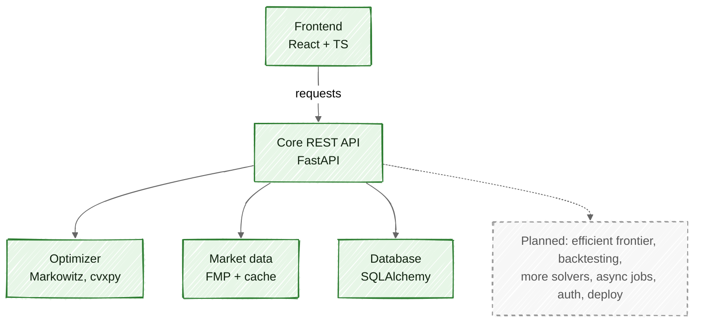
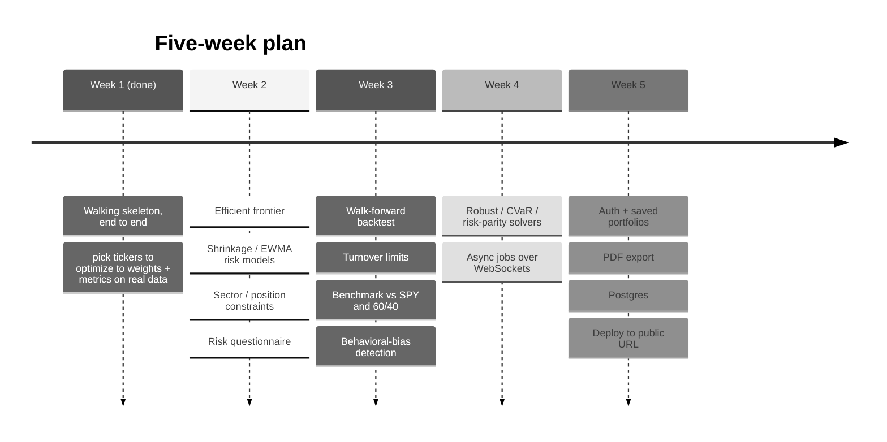

# Architecture (rough sketch)

Quick map of what is built versus what is still planned. Solid green boxes are
done. Dashed grey boxes are future work, tagged with the milestone (M2 to M5)
they belong to. Not exhaustive, just the shape of the system.

## System

## Roadmap

## One-liner

Built: the full vertical slice, frontend to REST API to Markowitz solver to real
data to database, for the core max-Sharpe / min-variance flow. Future work mostly
widens that slice (more solvers, risk models, backtesting) plus production concerns
(auth, async, deploy). Every architectural layer already exists; the rest bolts
onto layers that are already standing.
