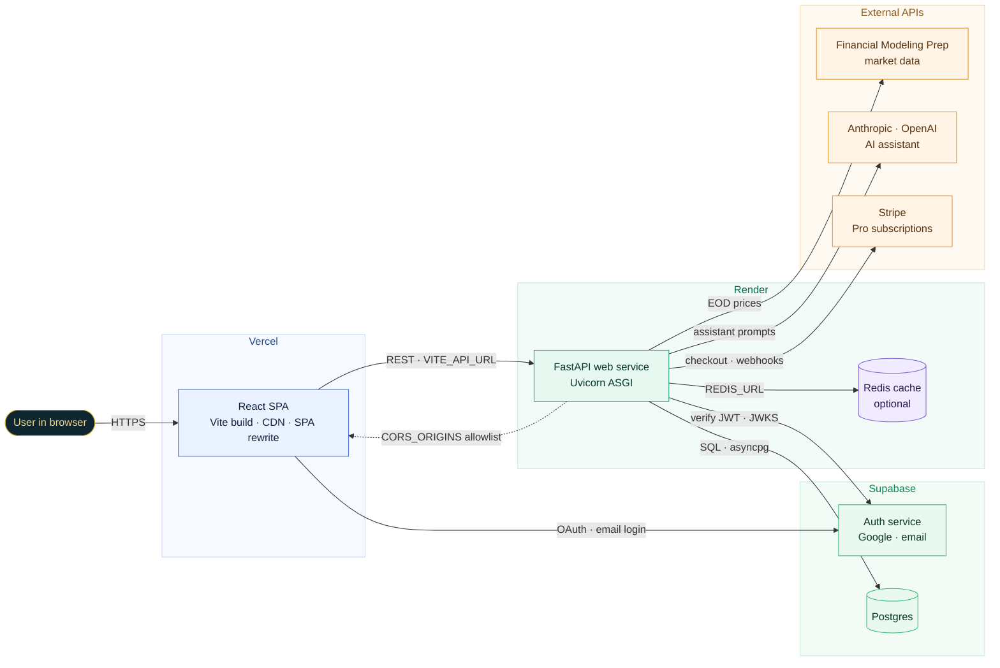
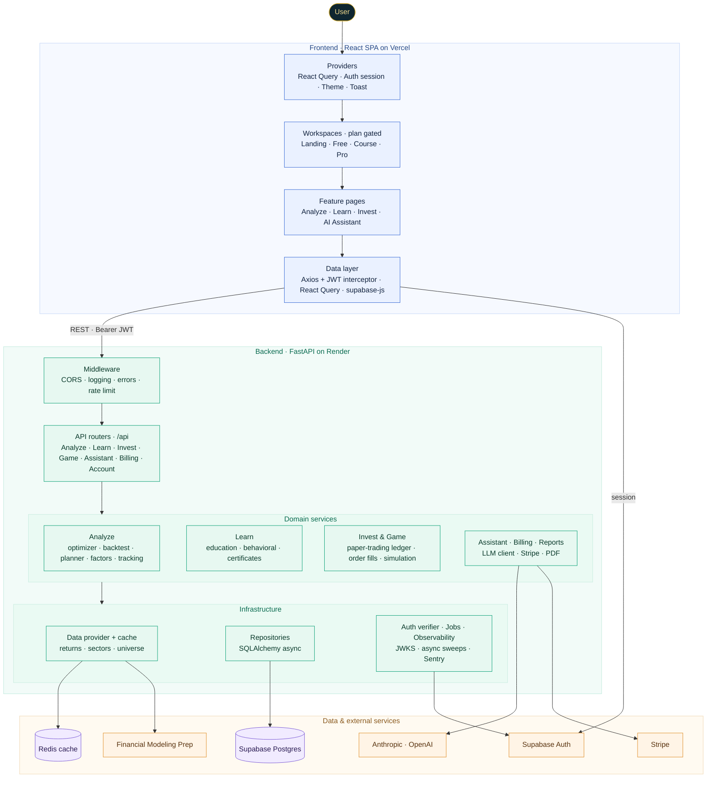

# Halo System Architecture

Halo is a full stack web app for building mathematically optimal stock portfolios with convex optimization, learning the theory, paper trading, and competing with friends. The diagrams below are written in Mermaid so they render directly on GitHub.

---

## Deployment topology

Three managed platforms host the system. The environment variables that wire the pieces together are labelled on the edges.

- The frontend builds with Vite and serves as static files behind Vercel's CDN. A rewrite sends only extensionless routes to `index.html`, so real assets are served directly.
- The backend is a single FastAPI service on Render started with Uvicorn. Redis is optional; when `REDIS_URL` is absent the cache falls back to an in memory store.
- Supabase manages Auth and Postgres. The API never holds passwords, it only verifies signed tokens.

---

## System architecture

The internal layers, from the browser down to the data and external services. The frontend renders one of three plan-gated workspaces; the backend is a thin routing layer over domain services and shared infrastructure, wired together by dependency injection.

### Data model

Persistent state lives in Supabase Postgres, defined by the SQLAlchemy models in `app/db/models.py`. The `profiles` table is the hub for everything a signed in user owns; its id equals the Supabase user id. Price bars, optimization runs, and backtest runs are global rather than user scoped.

```mermaid
erDiagram
    PROFILES ||--o{ SAVED_PORTFOLIOS : owns
    PROFILES ||--o{ ENROLLMENTS : has
    PROFILES ||--o{ TOPIC_PROGRESS : tracks
    PROFILES ||--o{ EXAM_RESULTS : records
    PROFILES ||--o{ CERTIFICATES : earns
    PROFILES ||--o| INVEST_ACCOUNTS : holds
    PROFILES ||--o{ INVEST_POSITIONS : holds
    PROFILES ||--o{ INVEST_ORDERS : places
    PROFILES ||--o{ INVEST_EQUITY_POINTS : logs
    PROFILES ||--o| BILLING_CUSTOMERS : billed_as

    PROFILES {
        string id PK
        string email
        string plan
        bool plan_selected
        datetime created_at
    }
    SAVED_PORTFOLIOS {
        int id PK
        string user_id FK
        string name
        string objective
        string risk_model
        json tickers
        json weights
        json metrics
    }
    ENROLLMENTS {
        int id PK
        string user_id FK
        string course_id
    }
    TOPIC_PROGRESS {
        int id PK
        string user_id FK
        string course_id
        string topic_id
    }
    EXAM_RESULTS {
        int id PK
        string user_id FK
        string course_id
        int score
        bool passed
    }
    CERTIFICATES {
        int id PK
        string user_id FK
        string course_id
        string credential_id
        datetime issued_at
    }
    INVEST_ACCOUNTS {
        string user_id PK
        float cash
        float starting_balance
        datetime created_at
    }
    INVEST_POSITIONS {
        int id PK
        string user_id FK
        string symbol
        float qty
        float cost_basis
    }
    INVEST_ORDERS {
        int id PK
        string user_id FK
        string symbol
        string side
        string status
        float notional
        datetime submitted_at
    }
    INVEST_EQUITY_POINTS {
        int id PK
        string user_id FK
        datetime ts
        float equity
    }
    BILLING_CUSTOMERS {
        string user_id PK
        string stripe_customer_id
        string stripe_subscription_id
        string status
    }
    PRICE_BARS {
        int id PK
        string provider
        string ticker
        date bar_date
        float close
    }
    OPTIMIZATION_RUNS {
        int id PK
        string objective
        json request
        json weights
        json metrics
    }
    BACKTEST_RUNS {
        int id PK
        json config
        json result
    }
```

A certificate carries a unique `credential_id` that backs a public verification page, so a completed track can be shared and checked by anyone. The `invest_*` tables are a self contained paper trading ledger, and `billing_customers` links a profile to its Stripe subscription.
